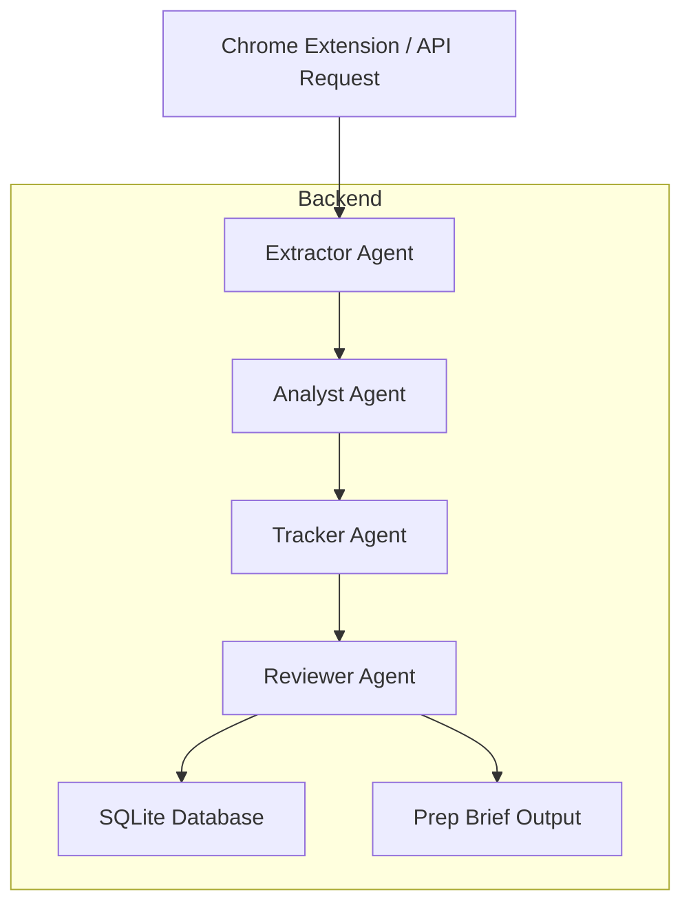

# Job Intel

Job Intel is an AI-powered job application tracker for F-1 OPT job seekers. It turns a pasted job URL into a tracked application by extracting job data, scoring fit against a candidate CV, checking visa sponsorship signals, saving the record to a tracker database, and scheduling follow-up reminders.

## Why it was built

Job seekers on OPT must manage dozens of applications while avoiding roles that do not sponsor visas. Manual tracking is time-consuming, error-prone, and difficult to scale. Job Intel automates the core workflow so candidates can focus on the most promising opportunities and avoid non-sponsoring roles.

## Key capabilities

- Extract structured job details from a URL or page text
- Score job fit against `cv.md`
- Detect sponsorship signals for OPT/H1B visa safety
- Save applications and analysis results in SQLite
- Create follow-up reminders for outreach cadence
- Generate a prep brief for tracked roles
- Support browser-based tracking through a Chrome extension

## Tech stack

| Layer | Technology |
|------|------------|
| Backend | Python 3.13 |
| Web framework | FastAPI |
| Database | SQLite |
| Web scraping | Playwright, BeautifulSoup |
| AI / NLP | Anthropic Claude via `anthropic` SDK |
| Data validation | Pydantic |
| Agent prompts | `.github/agents/*.agent.md` |
| Browser extension | Chrome extension in `extension/` |

## Architecture

The project uses a 4-agent pipeline that mirrors the AgentX design from the repo.



## Project structure

- `src/main.py` — FastAPI server exposing tracking and application APIs
- `src/pipeline.py` — orchestrates Extractor, Analyst, Tracker, and Reviewer agents
- `src/database.py` — SQLite schema and persistence operations
- `src/scraper.py` — job page scraping utility
- `src/tools.py` — helper functions for CV loading, agent prompt loading, sponsorship detection, and brief saving
- `src/models.py` — Pydantic models for pipeline results and requests
- `.github/agents/` — Agent prompt definitions for each pipeline step
- `extension/` — Chrome extension UI and background scripts
- `tests/` — unit tests for pipeline and helper logic

## Running locally

1. Create and activate a virtual environment:

```bash
python3 -m venv venv
source venv/bin/activate
```

2. Install dependencies:

```bash
pip install fastapi uvicorn anthropic playwright beautifulsoup4 python-dotenv httpx pydantic
```

3. Install Playwright browsers:

```bash
python -m playwright install chromium
```

4. Create a `.env` file with your Anthropic API key:

```bash
echo "ANTHROPIC_API_KEY=your_api_key_here" > .env
```

5. Initialize the database:

```bash
python -c "from src.database import init_db; init_db()"
```

6. Start the API server:

```bash
uvicorn src.main:app --reload --host 0.0.0.0 --port 8000
```

7. Open the browser extension or call the API directly.

## Chrome extension setup

1. Open Chrome and navigate to `chrome://extensions/`.
2. Enable `Developer mode`.
3. Click `Load unpacked`.
4. Select the `extension/` directory from this repository.
5. Make sure the backend server is running at `http://localhost:8000`.
6. Open a job posting in Chrome and use the extension's track button.

## API endpoints

| Endpoint | Method | Description |
|---------|--------|-------------|
| `/track` | POST | Track a job with `page_url`, `page_text`, and optional `page_title` |
| `/track-url` | POST | Track a job by URL only; the backend scrapes the page |
| `/applications` | GET | List all tracked applications |
| `/applications/{application_id}` | GET | Retrieve a single tracked application |
| `/applications/{application_id}/status` | PATCH | Update the application status |
| `/reminders` | GET | List applications with follow-up reminders due today |
| `/stats` | GET | Get aggregate application statistics |

### Example request for `/track-url`

```bash
curl -X POST http://localhost:8000/track-url \
  -H "Content-Type: application/json" \
  -d '{"url":"https://jobs.lever.co/openai"}'
```

## How AgentX is used

This project follows an AgentX-inspired workflow through agent prompt definitions stored in `.github/agents/`:

- `extractor.agent.md` — extracts structured fields from job page text
- `analyst.agent.md` — scores fit against the candidate CV and assesses visa risk
- `tracker.agent.md` — confirms follow-up reminders and tracking metadata
- `reviewer.agent.md` — validates the pipeline output and enforces OPT safety rules

The pipeline loads these agent definitions and uses Anthropic Claude to generate JSON outputs for each step.

## OPT / visa safety features

Job Intel includes explicit visa safety logic for F-1 OPT candidates:

- `src/tools.py` checks job text for sponsorship phrases and returns `likely`, `unlikely`, or `unknown`
- The Analyst agent outputs a `visa_risk` value of `low`, `medium`, or `high`
- The Reviewer agent hard-blocks applications when sponsorship is `unlikely` and visa risk is `high`
- Tracked applications store `sponsorship_signal` and `visa_risk` for transparent decision-making

## Testing

Run the unit tests:

```bash
./venv/bin/python -m pytest -q
```

## Output and data files

- Tracked applications are stored in `data/applications.db`
- Generated prep briefs are written to `output/`

## Notes

- Keep `cv.md` up to date so the Analyst agent can score fit accurately.
- The project is designed to help OPT candidates avoid non-sponsoring roles and maintain consistent follow-up cadence.
